 

 

## Hello

I'm Tom. I build infrastructure for software accountability.

I'm the creator and lead maintainer of [**Korext Open Source**](https://oss.korext.com): seven open standards for making AI generated code traceable, licensable, and accountable across software supply chains. The work focuses on a future where AI writes more code than humans can review, and where the discipline of governance has to keep pace.

Alongside the open standards, I'm Founder of [**Korext**](https://korext.com), the commercial governance runtime that enforces these standards inside regulated industries (banks, defense primes, healthcare systems).

 

## Open Standards

The seven packages I design, maintain, and ship.

<table>
<thead>
<tr><th align="left">Standard</th><th align="left">What it does</th><th align="left">Version</th></tr>
</thead>
<tbody>
<tr>
<td><a href="https://github.com/korext/ai-attestation"><strong>ai-attestation</strong></a></td>
<td>Verifiable provenance for the leading AI coding tools</td>
<td></td>
</tr>
<tr>
<td><a href="https://github.com/korext/supply-chain-attestation"><strong>supply-chain-attestation</strong></a></td>
<td>Adapters across the leading SBOM and signature ecosystems</td>
<td></td>
</tr>
<tr>
<td><a href="https://github.com/korext/ai-license"><strong>ai-license</strong></a></td>
<td>Licensing framework for AI generated code</td>
<td></td>
</tr>
<tr>
<td><a href="https://github.com/korext/ai-incident-registry"><strong>ai-incident-registry</strong></a></td>
<td>Public incident taxonomy and registry for AI code failures</td>
<td></td>
</tr>
<tr>
<td><a href="https://github.com/korext/ai-code-radar"><strong>ai-code-radar</strong></a></td>
<td>Detection pattern library for AI authored code</td>
<td></td>
</tr>
<tr>
<td><a href="https://github.com/korext/ai-regression-database"><strong>ai-regression-database</strong></a></td>
<td>Regression fingerprinting for AI code patterns</td>
<td></td>
</tr>
<tr>
<td><a href="https://github.com/korext/commit-carbon"><strong>commit-carbon</strong></a></td>
<td>Emissions accounting for software changes</td>
<td></td>
</tr>
</tbody>
</table>

Specifications: **CC0** (public domain). Code: **Apache 2.0**. Data: **CC BY 4.0**. Zero legal friction for adopters to build on the standards or contribute back.

 

## Korext Platform

> **The commercial governance runtime.**
>
> Korext is the enforcement layer for the open standards: it sits inside regulated industry development workflows and enforces policy, sovereignty, and audit at the moment code is written. Banks, defense primes, and healthcare systems cannot legally adopt autonomous coding tools without provable controls over what the AI writes, where the data sits, and who attests to the output.
>
> The standards are the substrate. The platform is the runtime.
>
> [**korext.com →**](https://korext.com)

 

## Day Job

Product and Platform Strategy Lead at **Google**, where my work centers on Chrome's AI platform, web ecosystem, and developer surfaces.

 

## Education

 

## Activity

  

 

## Connect

 

---

<i>The next decade of software gets written faster than humans can review it. Infrastructure for accountability has to ship at the same pace as the agents producing the code.</i>

